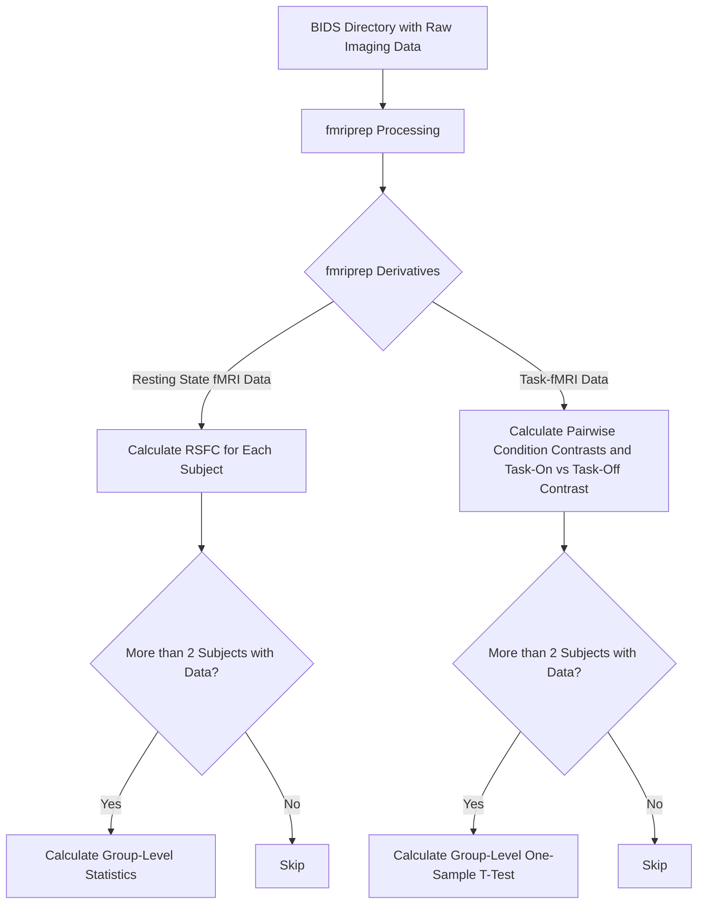

# nipoppy_demo

## Overview

This project aims to develop a script that can take any OpenNeuro repository as input, provided it contains at least one subject with a corresponding T1-weighted (T1W) image and a resting-state fMRI (rs-fMRI) recording. The script will preprocess the data using `fmriprep` and utilize a `nipoppy` style extractor to produce a connectivity matrix (conmat) according to the `BrainEffex` contribution specification.

## Features

- **Input:** Any OpenNeuro repository with at least one subject having T1W and rs-fMRI data.
- **Preprocessing:** Automated preprocessing of the input data using `fmriprep`.
- **Extraction:** Generation of connectivity matrices using a `nipoppy` style extractor.
- **Compliance:** Ensures output conforms to the `BrainEffex` contribution specification.

## Usage

1. **Clone the repository:**
   ```bash
   git clone https://github.com/yourusername/nipoppy_demo.git
   cd nipoppy_demo
   ```

## Roadmap


