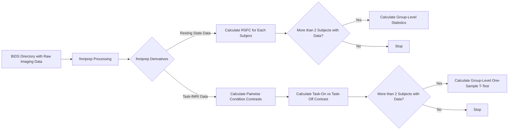

```mermaid
flowchart LR
    A[BIDS Directory with Raw Imaging Data] --> B[fmriprep Processing]
    B --> C{fmriprep Derivatives}
    C -->|Resting State Data| D[Calculate RSFC for Each Subject]
    D --> E{More than 2 Subjects with Data?}
    E -->|Yes| F[Calculate Group-Level Statistics]
    E -->|No| G[Stop]
    C -->|Task-fMRI Data| H[Calculate Pairwise Condition Contrasts]
    H --> I[Calculate Task-On vs Task-Off Contrast]
    I --> J{More than 2 Subjects with Data?}
    J -->|Yes| K[Calculate Group-Level One-Sample T-Test]
    J -->|No| L[Stop]
```
